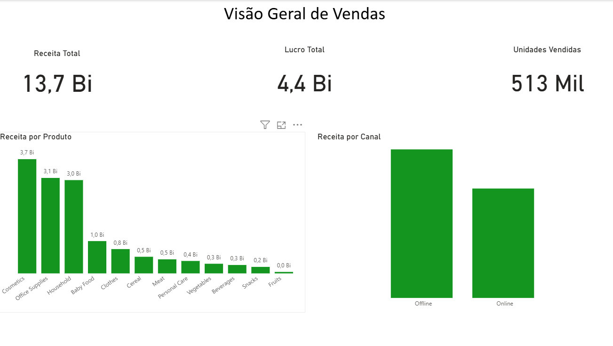
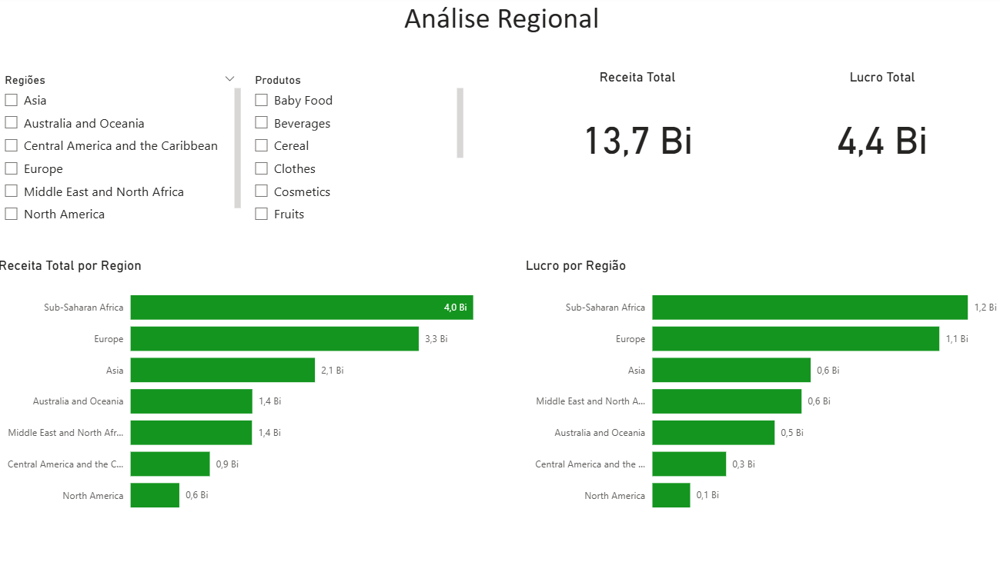
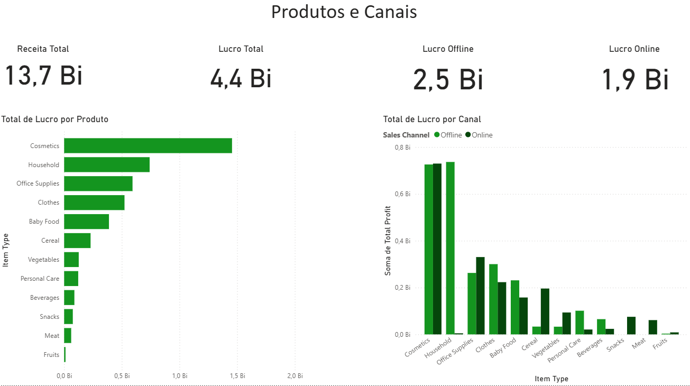
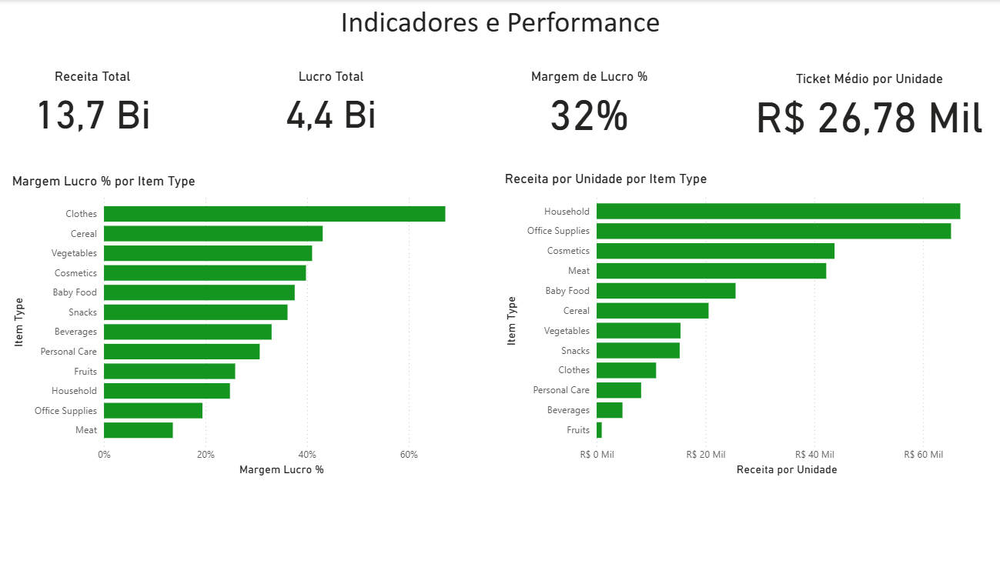
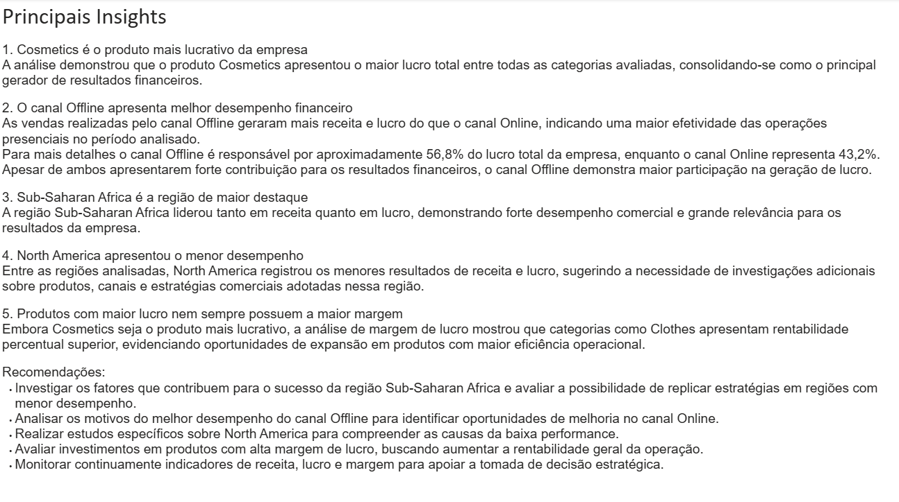

# 📊 Análise de Vendas Globais

Projeto desenvolvido em Power BI com foco em análise de vendas, lucro, desempenho regional e indicadores de performance.

## 🎯 Objetivo

Transformar dados de vendas em informações estratégicas para apoiar a tomada de decisão através de dashboards interativos e análises de negócio.

---

## 🛠 Ferramentas Utilizadas

- Power BI
- DAX
- SQL (PostgreSQL)
- Excel

---

## 📈 Principais Indicadores

- Receita Total: 13,7 Bi
- Lucro Total: 4,4 Bi
- Unidades Vendidas: 513 Mil
- Margem de Lucro: 32%

---

## 🌎 Principais Insights

### 1. Cosmetics foi o produto mais lucrativo

A categoria Cosmetics apresentou o maior lucro total entre todos os produtos analisados.

### 2. Canal Offline apresentou melhor desempenho

O canal Offline foi responsável por aproximadamente 56,8% do lucro total da empresa.

### 3. Sub-Saharan Africa liderou os resultados

A região apresentou o maior volume de receita e lucro entre todas as regiões avaliadas.

### 4. North America apresentou o menor desempenho

A região apresentou os menores resultados financeiros, indicando oportunidade para análises adicionais.

### 5. Maior lucro não significa maior margem

Produtos com menor lucro total apresentaram margens superiores, demonstrando oportunidades de expansão.

---

## 📸 Dashboard

### Visão Geral de Vendas

### Análise Regional

### Produtos e Canais

### Indicadores e Performance

### Insights e Recomendações

---

## 📚 Aprendizados

Durante este projeto foram aplicados conceitos de:

- Modelagem de dados
- Criação de KPIs
- DAX
- Visualização de dados
- Storytelling com dados
- Análise exploratória
- Desenvolvimento de dashboards executivos

---

## 👨‍💻 Autor

Rodrigo Alves

LinkedIn:
www.linkedin.com/in/rodrigo-alves-976486220
